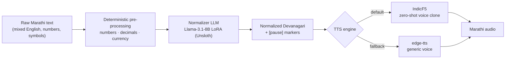
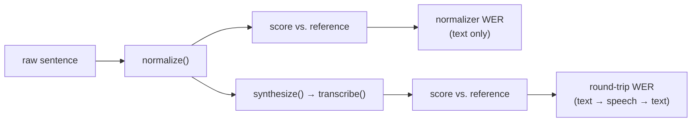

# Marathi TTS Text Normalization

**[→ Listen to the demo / see the training journey](./showcase)** — a static
showcase site (audio comparisons + Unsloth Studio & MLflow screenshots),
deployable to Vercel as-is.

Off-the-shelf TTS engines read Marathi text with a Hindi accent, a flat monotone, and frequent phonetic mistakes — the retroflex `ळ` collapses into `ल`, times like `२:३०` get read literally instead of spoken naturally, and English loanwords ("Office", "Laptop") come out mangled.

This project fixes that at the text layer: an LLM-based normalizer takes raw, messy Marathi input (mixed digits, English words, no punctuation cues) and rewrites it into clean, phonetically accurate, speech-ready Devanagari — expanded numbers, correct retroflex consonants, transliterated loanwords, and `[pause]` tags marking natural clause breaks. That normalized text is what a downstream TTS engine actually synthesizes, so the resulting audio sounds like a person, not a text-to-speech demo.



Numbers, decimals, and currency are expanded to words *before* the LLM ever
sees them — that part is a solved, mechanical problem, so it's solved
mechanically rather than trusted to the model.

## What it handles

| Problem | Typical TTS behavior | This pipeline |
| :--- | :--- | :--- |
| Retroflex `ळ` | Flattened to `ल` (`कमल` instead of `कमळ`) | Preserved correctly (`कमळ`, `बाळ`) |
| Numbers & times | Read digit-by-digit or misread | Spoken-form expansion (`दोन वाजून तीस मिनिटांनी`) |
| English loanwords | Foreign accent, mispronounced | Natural Devanagari transliteration (`ऑफिस`, `लॅपटॉप`) |
| Pauses & rhythm | Flat, no breathing room | `[pause]` tags inserted at natural clause boundaries |
| Conjuncts (`ज्ञा`, `क्ष`) | Often mangled | Rendered accurately |

## How the dataset is built

`dataset/generate_dataset.py` generates the training data for this normalization task using the Gemini API, in two steps:

1. **Generation** — prompts Gemini to produce diverse, natural raw Marathi sentences that mix in numbers, times, percentages, currency, units, and English loanwords, across a range of sentence types (statements, questions, exclamations, commands).
2. **Normalization** — each raw sentence is passed through a second Gemini call with the normalization rules above, producing the phonetically clean, pause-annotated Devanagari version.

Both steps are paced and retried to stay within API rate limits, and every record is flushed to disk as soon as it's produced — interrupting and re-running the script skips whatever's already done and continues.

The result is `dataset/marathi_speech_normalization.jsonl`, an Alpaca-style instruction dataset (split into `dataset/train.jsonl` / `dataset/eval.jsonl` for training):

```json
{
  "instruction": "Convert the raw Marathi text into phonetically normalized, speech-ready Devanagari text with pause annotations for TTS.",
  "input": "मी काल २:३० PM ला ५०० रुपयांचे पुस्तक विकत घेतले.",
  "output": "मी काल [pause] दोन वाजून तीस मिनिटांनी [pause] पाचशे रुपयांचे पुस्तक विकत घेतले."
}
```

`dataset/eda.ipynb` explores the generated dataset — length distributions, `[pause]` tag coverage, sentence-type mix, duplicate checks, and residual-English leak detection — to catch generation issues before the data goes into training.

## The eval loop

`eval_wer.py` runs every held-out sentence through four steps and produces
two separate scores, tracked in MLflow:



Splitting these on purpose: round-trip WER alone can't tell you whether a
bad score came from the normalizer, the voice engine, or Whisper mishearing
something. Normalizer WER isolates just the first step, so a regression in
one layer can't hide behind the other layer happening to sound fine.

## Setup

```bash
python3 -m venv .venv
source .venv/bin/activate
pip install -r requirements.txt
```

Create a `.env` file in the project root with your Gemini API key:

```
GEMINI_API_KEY=your_api_key_here
```

## Usage

Generate (or resume generating) the dataset:

```bash
python3 dataset/generate_dataset.py
```

Explore the dataset:

```bash
jupyter notebook dataset/eda.ipynb
```

## Project status

All three stages are built:

1. **Speech normalization dataset — done.** 1,798 training pairs / 200 eval pairs, Alpaca-format, generated and validated as described above.
2. **Fine-tuned normalization model — done.** `unsloth/Meta-Llama-3.1-8B` fine-tuned via QLoRA in Unsloth Studio (rank 32 / alpha 64) on the dataset above — normalization runs as a local model, not an API call.
3. **TTS synthesis — done.** The normalized output is spoken by [IndicF5](https://huggingface.co/ai4bharat/IndicF5) (zero-shot voice cloning, default) or edge-tts (fallback). Round-trip WER 0.63, on par with the edge-tts baseline, with a more natural voice by ear.

```
raw Marathi text → [1: normalization dataset] → [2: fine-tuned LLM] → [3: TTS engine] → audio
                         ✅ done                      ✅ done             ✅ done
```

Known gaps: ordinals (`3rd`, `10th`) come out with the wrong grammatical
case, and the model occasionally re-paraphrases a correctly-expanded number.
Both need the model retrained on more examples, not more code — see
[`showcase/`](./showcase) for the full "where it stands" writeup.

The normalization step is the highest-leverage part of this chain: most of the "robotic accent" and mispronunciation complaints against Marathi TTS trace back to bad input text, not a bad voice model. Getting Stage 1 right is what makes Stages 2 and 3 worth building.
