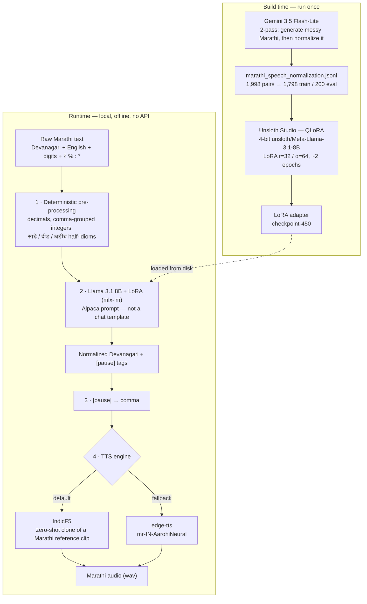
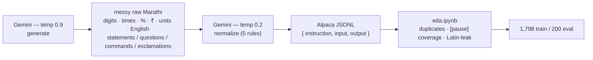
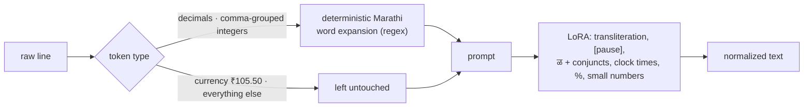
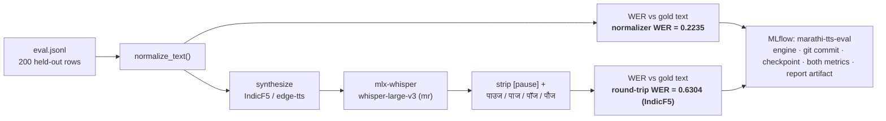

# Marathi TTS that sounds like a person: fixing speech at the text layer

**Subtitle:** How we distilled messy, code-switched Marathi into a local Llama 3.1 8B LoRA, then spoke it with IndicF5 — and what went wrong along the way.

Most complaints about Marathi text-to-speech are aimed at the voice. The voice is often fine. The **script** is not.

People type Marathi the way they actually type: Devanagari mixed with English, digits in both scripts, `₹62,000`, `२:३० PM`, `42.5°C`, `25% battery`. Off-the-shelf engines then read that string as if it were Hindi-flavored English with a colon in the middle. Retroflex `ळ` collapses into `ल`. There is no breath. Loanwords stay in Latin letters and come out foreign.

This project, **मराठी आवाज / Marathi TTS text normalization**, sits a translator in front of the speaker. A locally fine-tuned Llama rewrites the messy line into phonetically accurate, pause-annotated Devanagari. A Marathi-capable TTS model then reads *that*. We did not train a new voice from scratch. We trained the thing that decides **what the voice is allowed to say**.

The work started as a test of [Unsloth Studio](https://unsloth.ai): QLoRA on a Mac, no cloud training job. Marathi speech normalization was the test case because you can hear whether it worked.

---

## Why, how, and with what

**Why it exists.** Marathi TTS gets blamed for a "robotic Hindi accent." The
real defect is upstream: engines are handed raw, code-switched text
(`२:३० PM`, `₹62,000`, `Office`, `ळ` vs `ल`, no clause breaks) and asked to
invent Marathi phonology at synthesis time. Fix the text and the existing
voices already sound human. So the project builds the *text* layer, not a
voice.

**How it works.** A teacher LLM (Gemini) writes ~2,000 normalization
examples once. Those are distilled into a LoRA adapter on Llama 3.1 8B,
trained locally with QLoRA in Unsloth Studio. At runtime a deterministic
pass expands numbers, the LoRA rewrites everything else into
phonetically-accurate, `[pause]`-annotated Devanagari, `[pause]` becomes a
comma, and a Marathi-capable TTS engine (IndicF5, with edge-tts as
fallback) speaks it. Nothing calls an API at runtime.

**With what.**

| Layer | Tool |
| :--- | :--- |
| Training-label teacher | Gemini API (`gemini-3.5-flash-lite`), two-pass |
| Fine-tuning | Unsloth Studio, QLoRA (4-bit base + LoRA r=32 / α=64) |
| Base model | `unsloth/Meta-Llama-3.1-8B` (base, Alpaca prompt) |
| Local inference | `mlx-lm` on Apple Silicon |
| Number expansion | hand-written Marathi word lists + regex (`normalize.py`) |
| Voice (default) | [IndicF5](https://huggingface.co/ai4bharat/IndicF5) (AI4Bharat), zero-shot F5-TTS clone |
| Voice (fallback) | Microsoft edge-tts, `mr-IN-AarohiNeural` |
| Eval ASR | `mlx-whisper`, `whisper-large-v3` |
| Experiment tracking | MLflow (`marathi-tts-eval`) |
| Local demo | FastAPI (`server.py`, `127.0.0.1` only) + static `showcase/` |

---

## The problem in one table

| What you typed | What typical TTS does | What a speaker would say |
| :--- | :--- | :--- |
| `कमळ` | `कमल` (`ळ` → `ल`) | Keep the retroflex |
| `२:३० PM` | Digit-by-digit, or “two colon thirty” | `दोन वाजून तीस मिनिटांनी` |
| `Office`, `Laptop` | English accent | `ऑफिस`, `लॅपटॉप` |
| Long clause, no commas | Flat monotone | A breath at the clause boundary |
| `ज्ञ`, `क्ष` | Often mangled | Full conjuncts |

If you hand a voice model Latin `Office` and ASCII `2:30`, you are asking it to invent Marathi phonology at synthesis time. That is the wrong layer. **Grapheme-to-phoneme for this language starts with getting the Devanagari right.**

---

## Architecture: two models, four steps

Two things are trained/built once (left), and one path runs on every request
(right). The runtime path never touches the network.



1. **Number expansion** — regex + Marathi word lists, *before* the prompt.
2. **The LoRA** — transliteration, `[pause]` insertion, `ळ` and conjuncts,
   clock times, `%`, small numbers. Text only; it never produces audio.
3. **`[pause]` → comma** — no TTS engine understands the literal marker.
4. **Synthesis** — [IndicF5](https://huggingface.co/ai4bharat/IndicF5)
   (AI4Bharat), a zero-shot F5-TTS checkpoint that clones a short Marathi
   reference clip, is the default. Microsoft **edge-tts**
   (`mr-IN-AarohiNeural`) is the generic fallback.

The local FastAPI demo (`server.py`) binds to `127.0.0.1` only. The
shareable [showcase](../showcase/) is static: a pipeline screen recording,
pre-rendered raw-vs-normalized wavs, Unsloth Studio screenshots, MLflow
screenshots — no GPU at request time.

---

## Stage 0 — Why not just call Gemini forever?

The training labels were produced by Gemini. Runtime is **not** Gemini.

A teacher API is fine for generating 2,000 pairs once. It is a poor production normalizer: latency, cost, privacy, and it is the opposite of “fine-tune on this laptop.” The pipeline **distills** Gemini’s rewrite rules into a student that loads from disk.

That is the whole point of the Unsloth experiment: take a real low-resource-language gap, not a toy benchmark, and see whether a local QLoRA run is enough.

---

## Stage 1 — Building the dataset

`dataset/generate_dataset.py` uses the Gemini API (`gemini-3.5-flash-lite`) in two passes, paced for free-tier rate limits (~4.5s between calls, up to 5 retries on 429).

1. **Generation** (temperature 0.9): natural everyday Marathi that *must* mix digits, clock times, percentages, currency, units (`km` / `kg` / `GB`), English loanwords, and sentence types (statements, questions, exclamations, commands) — not a textbook corpus.
2. **Normalization** (temperature 0.2): the same linguistic rules the student must learn. JSON only: `{"normalized_text": "..."}`.

Rules given to the teacher:

1. Expand numbers into spoken Marathi (`२:३०` → `दोन वाजून तीस मिनिटांनी`, `५००` → `पाचशे`).
2. Expand symbols and abbreviations (`%` → `टक्के`, `p.m.` → `दुपारी`).
3. Transliterate English into Devanagari phonetics.
4. Insert `[pause]` at natural clause breaks.
5. Preserve `ळ` and conjuncts (`ज्ञा`, `क्ष`).

Each record is flushed immediately. Re-running skips inputs already on disk.

Output is Alpaca-format JSONL:

```json
{
  "instruction": "Convert the raw Marathi text into phonetically normalized, speech-ready Devanagari text with pause annotations for TTS.",
  "input": "मी काल २:३० PM ला ५०० रुपयांचे पुस्तक विकत घेतले.",
  "output": "मी काल [pause] दोन वाजून तीस मिनिटांनी [pause] पाचशे रुपयांचे पुस्तक विकत घेतले."
}
```

**Size:** 1,998 pairs in `marathi_speech_normalization.jsonl`, split into **1,798 train** / **200 eval**.



EDA (`dataset/eda.ipynb`) was run before training, not after hoping for the best:

- No duplicate inputs; a handful of duplicate outputs.
- Outputs are longer than inputs (numbers expand; pauses are added).
- About **5.9%** of gold outputs have zero `[pause]` tags (short sentences, which is reasonable).
- After stripping the ASCII `[pause]` marker, only **~0.2%** of outputs still leaked Latin characters — residual teacher mistakes, not the intended behavior.

The dataset is built to match **how Marathi is typed**, including `Train चा Ticket` and `₹50000`, not a cleaned literary register.

---

## Stage 2 — Why Llama 3.1 8B, why train, why 4-bit LoRA

### Why train

A stock Llama does not know this job. In Unsloth Studio’s playground, the **base model mostly echoed** the messy input. The **fine-tuned model** expanded numbers and inserted `[pause]`.

With ~1,800 examples you are teaching a **narrow rewrite skill**, not a new language. That is when you adapt a strong multilingual base instead of training an LLM or a vocoder from zero.

### Why Llama 3.1 8B

The trainer is Unsloth Studio; the checkpoint the code loads is `unsloth/Meta-Llama-3.1-8B`.

- **8B** is large enough for mixed Devanagari, English, and numbers. 1B–3B models are a poor bet for this linguistic mix.
- **8B** is small enough to train and later serve on a **MacBook (M5 Pro, 48 GB unified memory)** — the hardware this run actually used.
- **70B** would abandon the “local Studio, no cloud GPU” goal.
- **Llama 3.1** is substantially stronger on non-English scripts than Llama 2.

Llama only produces **text**. IndicF5 produces **audio**.

(An older page in `site/` says “8B-Instruct.” The running path is the Unsloth **base** 8B plus an **Alpaca** prompt. That matches how the LoRA was trained.)

### Why LoRA, not a full fine-tune

Full fine-tuning updates all ~8 billion parameters. For 1,798 pairs that is how you overfit and forget.

**LoRA** freezes the base and trains small adapter matrices on seven modules: `q_proj`, `k_proj`, `v_proj`, `o_proj`, `gate_proj`, `up_proj`, `down_proj`. Rank **32**, alpha **64**. The portable artifact is `checkpoint-450`, not a second 16GB model.

### Why 4-bit (QLoRA)

Quantization is **not** what learns Marathi. It compresses the **frozen** 8B so training fits.

| Precision | Weights only (order of magnitude) |
| :--- | :--- |
| 16-bit 8B | ~16 GB |
| 4-bit 8B | ~4 GB |

**QLoRA:** load the base in 4-bit, keep LoRA in higher precision, backprop only through the adapters. Mid-run the Studio GPU monitor sat at **~8.6 GB of 48 GB**, 99% utilization, 88.6 °C. Config: batch size 2 × gradient accumulation 4 (effective batch 8), AdamW, learning rate `2e-4`, linear schedule. The run was configured for **750 steps**; the exported adapter is **checkpoint-450** — about **2 epochs** over 1,798 pairs at effective batch 8.

Without QLoRA, teaching an 8B model on this machine is the hard part. Without LoRA, you would be rewriting the whole network. Without training, you still have a chatbot that echoes `2:30`.

### Inference prompt discipline

The LoRA never saw chat-template tokens. Using `apply_chat_template()` caused **runaway generation** (no learned EOS). Inference (`normalize.py`, **mlx-lm**) uses the same Alpaca string as training:

```
### Instruction:
...
### Input:
...
### Response:
```

Defensive decoding, all in `normalize.py`: repetition penalty 1.3; truncate at any leaked `### Instruction:` / `### Input:` / `### Response:` marker; a sentence-count check (the response shouldn't have more terminal `.!?` than the input did); and a verbatim-restart check that cuts the response if its own opening 3 words reappear later (the model sometimes restarts after a `[pause]` instead of ending). Those are patches. The real fix for EOS is more training or proper stop strings in `generate()`.

---

## Stage 2b — Numbers the LLM was not allowed to guess

Eval showed checkpoint-450 **drifting on decimals and comma-grouped integers**: `18.5` became the wrong integer plus a random separator word (`पॉईंट` / `दशांश` / `पूर्णांक` — the Gemini labels were inconsistent). `₹62,000` came back as 82,000. A Devanagari-digit amount came back as gibberish.

**Numbers are a solved problem.** They are expanded with deterministic Marathi word lists **before** the prompt:

- Non-currency decimals: `42.5` → `साडेबेचाळीस` (Marathi half-idioms: `दीड`, `अडीच`, `साडे`+number), otherwise `पूर्णांक` digit-by-digit. Works for ASCII and Devanagari digits.
- Currency decimals (`₹105.50`, including a space after `₹`) are **left alone** so the model can do rupees/paise.
- Western comma groups (`62,000`) become words. Indian lakh grouping (`1,00,000`) is **not** handled; it never showed up in eval.

This is the right engineering split: the LLM does transliteration, pauses, and messy language. Regex does arithmetic.



---

## Stage 3 — A voice that can actually read Marathi

The original plan named Coqui **XTTS v2** and **Kokoro**. Their language lists do not include Marathi. They were dropped.

**IndicF5** is zero-shot cloning: a reference wav + its **exact** transcript, then new text in that voice. Architecture in this repo: F5-TTS Base **DiT** (`dim=1024`, `depth=22`, `heads=16`, `ff_mult=2`, `text_dim=512`, `conv_layers=4`), Vocos vocoder, weights from `ai4bharat/IndicF5`, run on MPS via a vendored `f5_tts` snapshot.

### The reference clip

IndicF5’s shipped Marathi prompt was tagged **happy**. Every sentence sounded like shouting. We swapped in a calm “Read” scenario line from [IndicVoices-R](https://huggingface.co/datasets/ai4bharat/indicvoices_r) (CC-BY-4.0), Marathi test parquet row 32, CER 0.0 — a dataset-verified transcript, not an ASR guess. See `assets/ATTRIBUTION.md`.

### `[pause]` is not a TTS token

No engine we used understands the literal marker. edge-tts **read the word “pause” aloud**. IndicF5 **degenerated** on it. Both clients rewrite `[pause]` to a **comma** first. Commas are the one pause cue these engines honor.

### The f5-tts PyPI regression

The current `f5-tts` package (`infer_process`) **deterministically** repeated a garbage token on a large fraction of real sentences — including short, boring Marathi with no pauses. Same text, same reference, byte-identical failure on retry. AI4Bharat’s older bundled `f5_tts` snapshot did not.

We **vendored** that snapshot (`vendor/indicf5_f5_tts/`) and patched environment bugs in the copy. Official package: garbage audio on **151 / 200** eval rows. Vendored snapshot: **0 / 200**.

That bug only showed up in **round-trip** scores. The normalizer’s text was fine. If we had only scored text, we would have shipped a broken speaker.

---

## Evaluation: two WERs, on purpose

`eval_wer.py` runs every held-out sentence through:

1. `normalize_text` → **normalizer WER** (hypothesis vs gold text).
2. Synthesize → **mlx-whisper** (`whisper-large-v3`, `language="mr"`) → **round-trip WER**.

Word error rate is classic Levenshtein at word level (`word_error_rate()` in `eval_wer.py`).



**Why two numbers?** Round-trip WER stacks three error sources: normalizer, TTS, Whisper. A pretty voice can hide a bad rewrite. A good rewrite can look terrible if ASR hallucinates.

Whisper regularly inserts `पाउज` / `पाज` / `पॉज` / `पौज` at the silence that used to be `[pause]`. Eval strips gold `[pause]` tags **and** those hallucination tokens so we are not scoring a word nobody spoke.

Runs are logged to **MLflow** (`marathi-tts-eval`): engine, git commit, checkpoint path, both metrics, the JSONL report as an artifact.

MLflow is how a "looks fine on a spot check" change was caught. Disabling `repetition_penalty` (an attempt to fix a compound-number bug) passed a 9-case spot check cleanly, but the full 200-row run showed **normalizer WER jumping 0.2235 → 0.3274** — two rows had collapsed into an unbounded token-repeat loop the spot check never hit. Reverted before it shipped.

### Headline numbers (200 eval sentences)

| Metric | Value |
| :--- | ---: |
| Normalizer WER (text only) | **0.2235** |
| Round-trip WER, IndicF5 | **0.6304** |
| Round-trip WER, edge-tts | **~0.64** |
| Garbage / degenerate audio after vendor fix | **0 / 200** |

IndicF5 is **on par** with edge-tts on round-trip WER and **better by ear** (native clone vs generic neural voice). Round-trip in the 0.6s is not “60% of words wrong in the script.” Whisper on synthesized Marathi is noisy. That is why the **0.22 text WER** is the number that describes the LoRA.

---

## What you can hear without running anything

The showcase Listen tab uses the **same IndicF5 voice** on raw vs normalized text:

1. **Currency:** `Market मध्ये Gold चा भाव आज प्रति 10 gram ₹62,000 आहे.` — raw drops English and the number; normalized reads `बासष्ट हजार रुपये`.
2. **Temperature:** `४२.५°C` → `साडेबेचाळीस अंश सेल्सिअस`, `Impossible` → `इम्पॉसिबल`.
3. **Percent:** `२५% battery` → `पंचवीस टक्के बॅटरी`.
4. **Paise:** `₹ १०.५०` → `दहा रुपये, पन्नास पैसांनी` (not “point five zero”).
5. **Ordinal (known gap):** `1st floor` / `Restaurant` improve, but `पहिला मजला` is the **wrong case**; it should be `पहिल्या`. That needs more training pairs, not another regex.

---

## What still does not work

Honest leftover list:

- **Ordinals** (`3rd`, `10th`, `1st floor`): grammatical case depends on context. Data problem.
- **The model sometimes rewrites a number** that preprocessing already expanded correctly. Data / training problem.
- **Indian comma grouping** (`1,00,000`) is not in the integer expander.
- **Runaway generation** is mitigated with heuristics, not a clean EOS.
- **Half-idioms** (`साडे-`) are implemented for wholes &lt; 100; larger `.5` values fall back to generic `पूर्णांक`.

None of these are “add a bigger TTS model.” They are **more and better Marathi rewrite examples**, then another Unsloth run.

---

## How the repo is laid out

| Path | Role |
| :--- | :--- |
| `dataset/generate_dataset.py` | Gemini teacher: raw + gold pairs |
| `dataset/eda.ipynb` | Sanity-check before training |
| `dataset/train.jsonl`, `eval.jsonl` | Alpaca split |
| Unsloth Studio | QLoRA; export adapter |
| `normalize.py` | Preprocess + mlx-lm LoRA |
| `tts_client.py` | edge-tts + pause rewrite |
| `indicf5_client.py` | IndicF5 + vendored f5_tts |
| `speak.py` | CLI: text → `output/*.wav` |
| `server.py` + `site/` | Local browser demo |
| `transcribe.py` | Whisper for eval |
| `eval_wer.py` | Dual WER + MLflow |
| `vendor/indicf5_f5_tts/` | Known-good F5-TTS snapshot |
| `assets/reference_voice.wav` | Clone source (IndicVoices-R) |
| `showcase/` | Static site for Vercel |

Typical local speak path:

```bash
python3 speak.py "मी काल संध्याकाळी ५ वाजता ऑफिसला गेले." --engine indicf5
```

Adapter path defaults to the Unsloth Studio export; override with `NORMALIZE_ADAPTER_PATH`.

---

## Design lessons that transfer

1. **Fix the text before you blame the vocoder.** For Indic TTS, mixed-script input is the default, not an edge case.
2. **Distill a teacher into a small student** when the teacher is an API and the student must run offline.
3. **Do not ask the LLM to do arithmetic.** If eval shows digit errors, expand numbers outside the model.
4. **Score layers separately.** One WER cannot tell you whether to vendor a TTS library or collect more ordinals.
5. **Literal control tokens are not audio.** `[pause]` is a training convenience. Engines need punctuation they already understand.
6. **Pin the inference stack that actually works.** A PyPI bump can be a silent quality regression that only audio round-trip reveals.
7. **QLoRA is how 8B becomes a laptop experiment**, not a statement about Marathi requiring 4-bit physics.

---

## Status

All three stages exist: dataset, local LoRA normalizer, Marathi synthesis. The system is **working, not flawless**. The highest-leverage remaining work is **more gold examples** for ordinals and number fidelity — then train again — not a new voice architecture.

If you only remember one sentence: **Marathi TTS sounds robotic when the model is asked to speak chat-language as if it were already a script. This project writes the script.**
