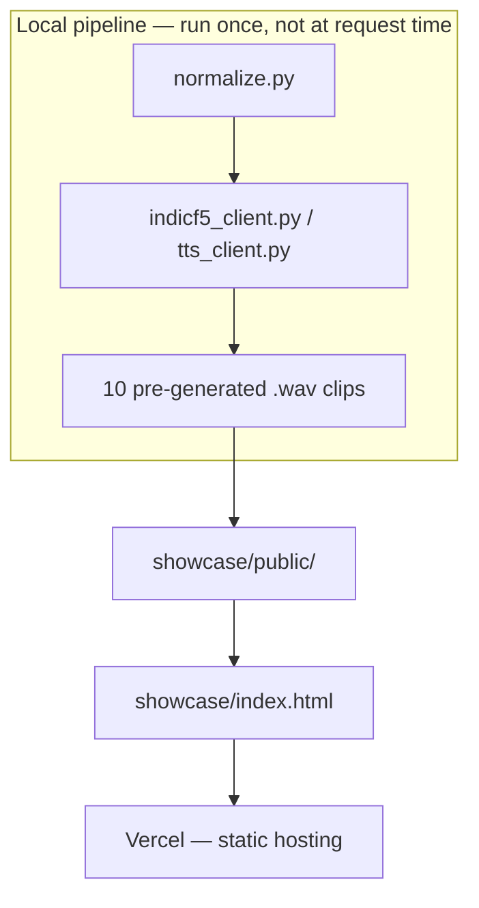

# मराठी आवाज — showcase site

A static, dependency-free showcase site for the Marathi TTS pipeline: three
tabs, no build step, no backend.

- **Demo** — a screen recording walking through the full pipeline end to end
  (`public/marathi-tts-demo.mp4`).
- **Listen** — five real sentences run through the pipeline, raw vs.
  normalized text, same IndicF5 voice, audio embedded directly so anyone can
  hear the difference without running any code.
- **Training journey** — real Unsloth Studio and MLflow screenshots, model
  configuration, and the honest current status (including known gaps).

This is separate from `../site/` (the FastAPI-backed live-synthesis demo in
the main repo, which needs the actual model running locally) — this is a
pre-generated, static, host-anywhere version for sharing.



Everything in `showcase/` is pre-baked: no server, no live model calls, no
API keys needed at request time — just static files Vercel serves as-is.

## Structure

```
showcase/
  index.html           everything — markup, styles, tab-switching JS
  public/
    marathi-tts-demo.mp4  full-pipeline screen recording (Demo tab)
    audio/              10 pre-generated .wav clips (5 sentences × raw/normalized)
    screenshots/
      unsloth/           5 Unsloth Studio training screenshots
      mlflow/             2 MLflow tracking screenshots
```

## Run locally

No build step — just serve the folder:

```
cd showcase
python3 -m http.server 8080
```

Then open `http://localhost:8080`.

## Deploy to Vercel

Zero config needed — it's a plain static site.

1. Push this repo to GitHub (if not already).
2. In Vercel: **New Project** → import the repo → set **Root Directory** to `showcase`.
3. Framework preset: **Other**. Leave build command and output directory blank.
4. Deploy.

Or via the CLI, from this directory:

```
cd showcase
npx vercel --prod
```

## Analytics

`index.html` already includes the Vercel Web Analytics script tag
(`/_vercel/insights/script.js` — the plain-HTML integration, no npm package
needed). It's inert until you flip one switch:

1. In the Vercel dashboard, open this project.
2. Go to the **Analytics** tab → **Enable**.

That's it — no further code changes. It then tracks visits, referrers, and
visitor **country** (Vercel's Web Analytics reports geography at country
granularity, not city/precise-location, and doesn't use cookies). Data
shows up in that same tab a few minutes after the first real visit post-enable.
